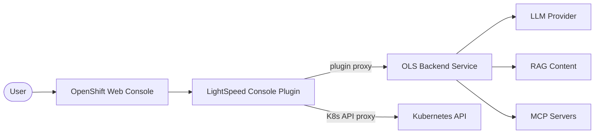
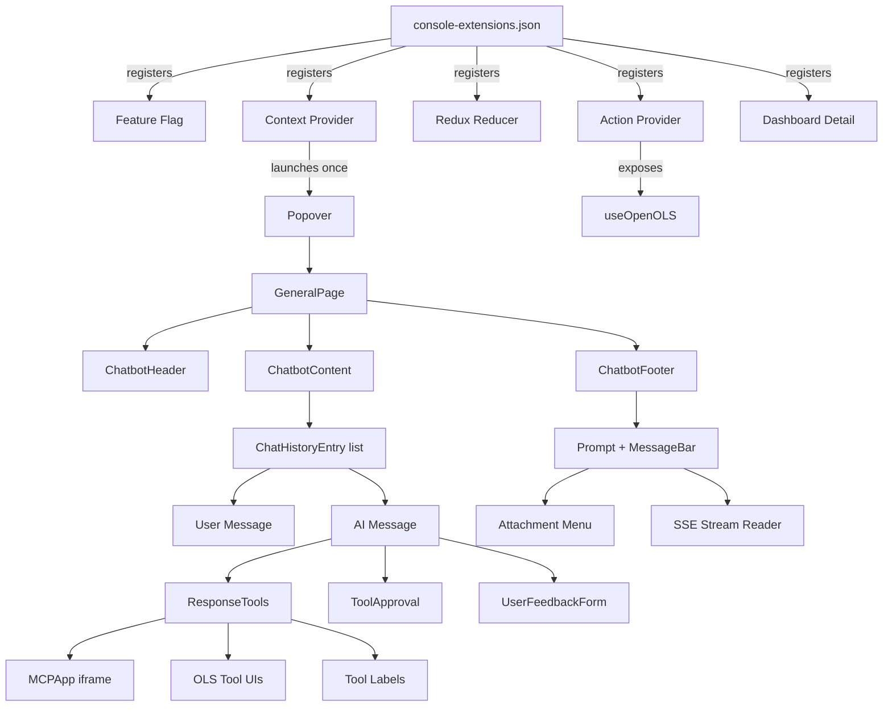
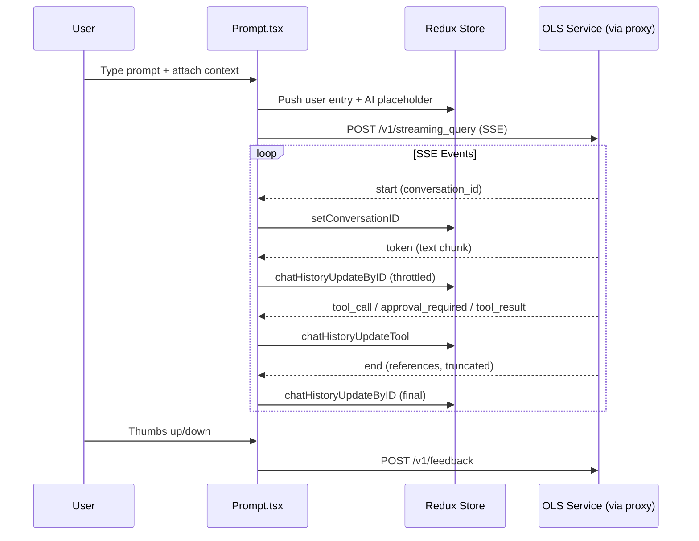

# Architecture

The OpenShift LightSpeed console plugin is a dynamic plugin for the OpenShift web console that adds an AI chat assistant. It runs inside the console as a Webpack Module Federation remote, communicating with the OLS backend service (lightspeed-service) through the console's built-in plugin proxy.

## System Context

The plugin is a pure UI client — it has no local AI processing, no persistent storage, and no direct LLM communication. All intelligence comes from the OLS backend service.

## Component Architecture

The plugin registers five console extensions at load time. The context provider launches the Popover as a console modal exactly once. From there, GeneralPage renders the chat interface with PatternFly Chatbot components.

## Data Flow

### Query Lifecycle

Responses are streamed as Server-Sent Events. Token updates are throttled to prevent excessive re-renders. The stream reader buffers incomplete lines across TCP chunks.

### Tool Approval (Human-in-the-Loop)

When the OLS service needs user approval for a tool call, it sends an `approval_required` SSE event. The plugin renders an approval card with Approve/Reject buttons. The decision is POSTed back to the service, which then continues or halts the tool execution.

### MCP App Interactive UI

Some tool results include a UI resource URI pointing to an HTML application hosted by an MCP server. The plugin loads this HTML into a sandboxed iframe (`allow-scripts` only) and communicates with it via bidirectional JSON-RPC 2.0 over `postMessage`.

## State Management

All plugin state lives in a single Redux reducer registered under `state.plugins.ols`. State values use Immutable.js (`ImmutableMap` and `ImmutableList`), accessed via `.get()` and `.getIn()` rather than property access.

Key state slices:
- **UI state**: popover open/close, display mode, query mode, auto-submit flag
- **Chat content**: ordered history of user and AI entries, current prompt text, conversation ID
- **Attachments**: map of attached resources keyed by composite ID
- **Tool interaction**: currently open tool detail modal

State is in-memory only — nothing persists across page refreshes.

## API Surface

All OLS API calls go through the console's plugin proxy at `/api/proxy/plugin/lightspeed-console-plugin/ols/`.

| Method | Path | Purpose |
|--------|------|---------|
| POST | `/authorized` | Authorization check |
| POST | `/v1/streaming_query` | Submit query, receive SSE stream |
| GET | `/v1/feedback/status` | Check if feedback is enabled |
| POST | `/v1/feedback` | Submit user feedback |
| POST | `/v1/tool-approvals/decision` | Approve/deny tool execution |
| POST | `/v1/mcp-apps/tools/call` | Direct MCP tool call (from iframe) |
| POST | `/v1/mcp-apps/resources` | Load MCP App UI resource (HTML) |

## Extension Points

Other console plugins can interact with this plugin through:

1. **Feature flag** — `LIGHTSPEED_PLUGIN` indicates the plugin is loaded
2. **Action provider** — `useOpenOLS` hook lets other plugins open the chat with a prompt, attachments, and optional auto-submit
3. **Tool UI extensions** — `ols.tool-ui` extension type lets other plugins register custom visualization components for specific tool results

## Technology Stack

- **Framework**: React 18 + TypeScript (ES2020 target)
- **Build**: Webpack 5 with Module Federation (`ConsoleRemotePlugin`)
- **UI library**: PatternFly 6 + PatternFly AI Chatbot
- **State**: Redux + Immutable.js
- **Console SDK**: `@openshift-console/dynamic-plugin-sdk`
- **Testing**: Playwright (e2e), Node built-in test runner (unit)
- **Linting**: ESLint + Prettier + Stylelint

## Key Architectural Decisions

**Streaming in Prompt.tsx** — All SSE stream processing lives in a single component (`Prompt.tsx`) inside the `onSubmit` callback closure. This co-locates input handling and stream processing, making `Prompt.tsx` the largest component but keeping streaming state per-request and automatically cleaned up.

**Immutable.js for Redux state** — State uses `ImmutableMap<string, any>`, providing structural sharing for efficient updates but no compile-time key safety. Access requires `.get()` / `.getIn()` ceremony throughout the codebase.

**Plugin proxy for all API calls** — The plugin never connects directly to the OLS service. The console's proxy handles authentication, TLS, and routing. In development, `start-console.sh` adds an additional proxy from the console container to `localhost:8080`.

**Auto-submit via DOM click** — Programmatic submission clicks the MessageBar's send button rather than calling `onSubmit` directly, because the PatternFly MessageBar manages internal state that would otherwise get out of sync.
